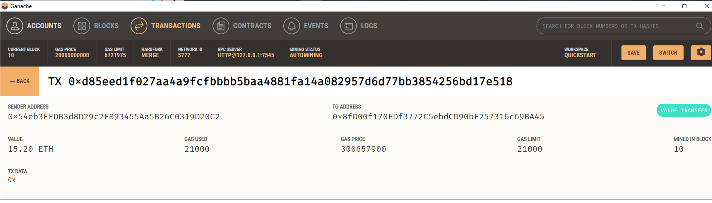
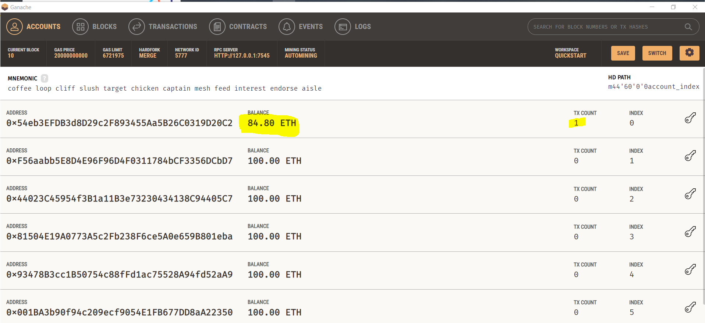

# challenge_19
# Background
The assignment consists of creating a cryptocurrency wallet based on the Ethereum blockchain network integration into the KryptoJobs2Go application. KryptoJobs2Go is an application developed by a startup, allowing customers to find fintech professionals, hire them, and pay them instantly using cryptocurrency. The task involves integrating Ethereum blockchain functionalities into the application's web interface to enable seamless transactions between customers and hired professionals.

## Code Functionality
The code includes Python scripts for both the KryptoJobs2Go application (`krypto_jobs.py`) and the Ethereum transaction functions (`crypto_wallet.py`). The `krypto_jobs.py` file contains code for the web interface of the application, which allows users to interact with the platform. On the other hand, `crypto_wallet.py` comprises functions for generating Ethereum accounts, checking balances, and sending transactions.

The completed `krypto_jobs.py` file integrates the Ethereum transaction functions into the KryptoJobs2Go application. This enables users to perform various wallet operations, including generating accounts, checking balances, and sending transactions.

## Screenshots confirming successful transactions

*Screenshot from streamlit web interface showing professional Jo, hired for 80hours @ 0.19 rate and total wage of 15.2*

*Screenshot showing corresponding transaction in Ganache depicting the transaction done through Streamlit.*

*Screenshot of the sender's address, balance, transaction count  in Ganache.*
